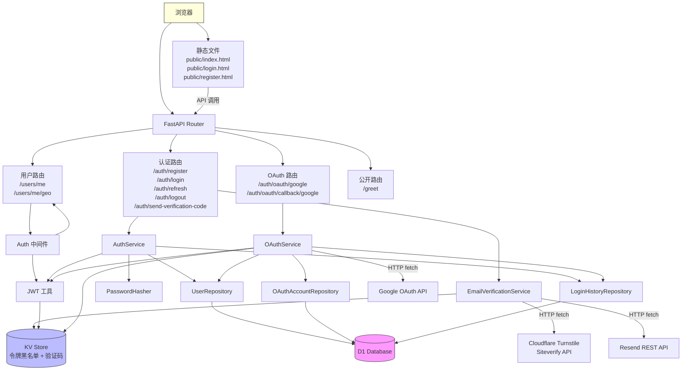
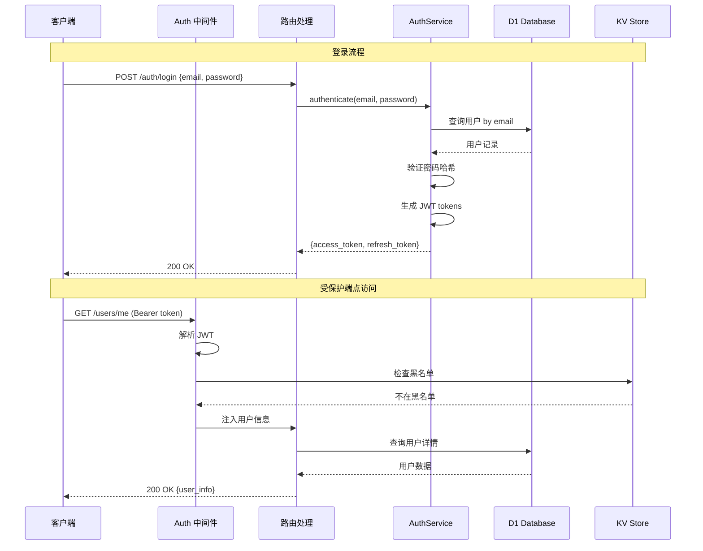
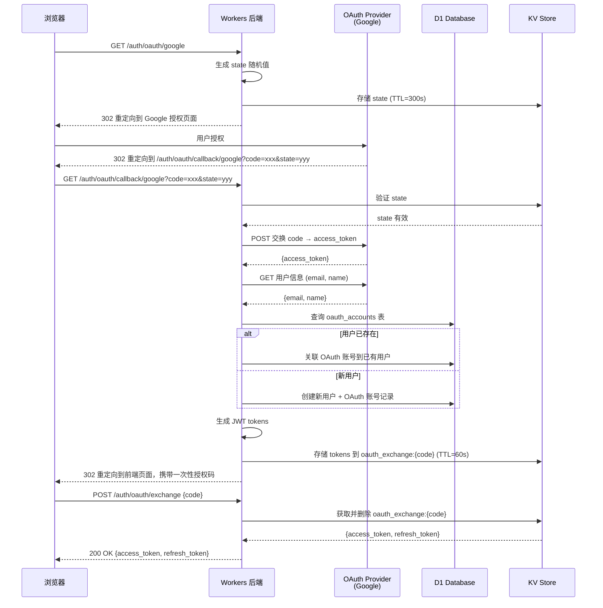
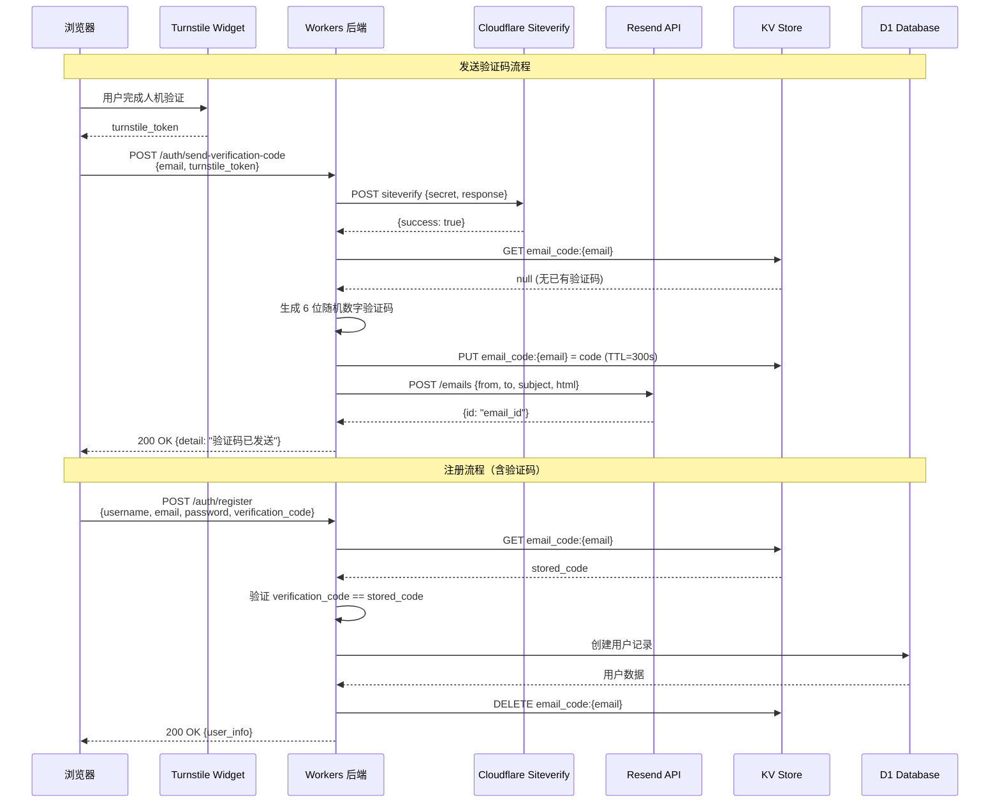

# 设计文档

## 概述

本设计为 `cloudflare-auth` 项目实现用户认证与授权系统。系统运行在 Cloudflare Workers Python 环境中，使用 FastAPI 框架，D1 数据库存储用户数据，KV 存储管理令牌黑名单。

核心设计决策：
- **JWT 实现**：由于 Cloudflare Workers Python 环境基于 Pyodide，标准 `PyJWT` 库可能不可用。使用 `hashlib` + `hmac` + `base64` 手动实现 JWT HS256 签名验证，这些都是 Pyodide 内置模块。
- **密码哈希**：Pyodide 环境不支持 `bcrypt`。使用 `hashlib.pbkdf2_hmac` (SHA-256) 配合随机盐值实现密码哈希，这是 Pyodide 内置支持的安全方案。
- **环境绑定访问**：通过 `asgi.env` FastAPI 依赖注入获取 D1 和 KV 绑定。
- **令牌黑名单**：使用 KV 存储，利用其 TTL 特性自动清理过期的黑名单条目。
- **前端页面**：登录和注册页面作为静态 HTML 文件放在 `public/` 目录下，使用 TailwindCSS CDN 实现样式，采用极简现代化设计风格。所有页面的公共样式统一在 `public/styles/common.css` 中维护，各 HTML 页面通过 `<link rel="stylesheet" href="/styles/common.css">` 引用。通过 JavaScript 调用后端 API。
- **第三方 OAuth 登录**：支持 Google OAuth 2.0 授权码流程。OAuth 回调由后端处理，完成令牌交换和用户信息获取后，将系统 JWT 传递给前端。
- **OAuth 状态管理**：使用 KV 存储保存 OAuth state 参数，防止 CSRF 攻击，state 设置短 TTL 自动过期。
- **邮箱验证码**：注册时通过 Resend REST API 发送 6 位数字验证码到用户邮箱。验证码存储在 KV 中（TTL=300s），有效期内不允许重复发送。由于 Pyodide 环境无法使用 Resend Python SDK，使用 Pyodide 内置的 `fetch` API 直接调用 Resend REST API（`POST https://api.resend.com/emails`）。支持通过 `RESEND_TEMPLATE_ID` 环境变量配置 Resend 平台模板，实现邮件内容的动态维护与热更新；未配置时自动回退到内置 HTML 模板。邮件模板源文件位于 `template/verification-code-email.html`，供开发者维护到 Resend 平台。
- **人机验证**：使用 Cloudflare Turnstile 作为 CAPTCHA 替代方案，在发送验证码前验证用户为真人。前端嵌入 Turnstile 小部件，后端通过 Siteverify API 验证 token。

## 架构



### 请求流程



### OAuth 2.0 登录流程



### 邮箱验证码注册流程



## 组件与接口

### 1. 项目结构

```
src/
├── main.py              # 入口，FastAPI app 定义，路由注册
├── auth/
│   ├── __init__.py
│   ├── router.py        # 认证相关路由 (/auth/*)
│   ├── oauth_router.py  # OAuth 路由 (/auth/oauth/*)
│   ├── service.py       # 认证业务逻辑
│   ├── oauth_service.py # OAuth 业务逻辑
│   ├── email_verification_service.py  # 邮箱验证码业务逻辑（Turnstile 验证 + Resend 发送 + KV 存储）
│   ├── dependencies.py  # FastAPI 依赖（获取当前用户等）
│   └── models.py        # Pydantic 请求/响应模型
├── users/
│   ├── __init__.py
│   ├── router.py        # 用户相关路由 (/users/*)
│   ├── repository.py    # 用户数据库操作（含 oauth_accounts 表）
│   └── login_history_repository.py  # 登录历史记录数据库操作
├── core/
│   ├── __init__.py
│   ├── jwt_utils.py     # JWT 生成与验证
│   ├── password.py      # 密码哈希与验证
│   └── config.py        # 配置常量（含 Google OAuth 配置、邮箱验证码配置）
└── schema.sql           # D1 数据库建表 SQL
template/
└── verification-code-email.html  # 邮箱验证码邮件模板源文件（供开发者维护到 Resend 平台）
public/
├── scripts/
│   ├── alert.js         # Alert 组件全局 JS（showAlert 函数）
│   ├── index.js         # 主页逻辑（认证检查、用户信息加载、退出登录）
│   ├── login.js         # 登录页逻辑（表单提交、OAuth 错误处理、重定向）
│   ├── oauth-callback.js # OAuth 回调逻辑（授权码交换 tokens）
│   ├── profile.js       # 个人信息页逻辑（Tab 切换、数据加载、设置密码）
│   └── register.js      # 注册页逻辑（Turnstile 初始化、验证码发送、表单提交）
├── styles/
│   └── common.css       # 公共样式文件（Naive UI 风格，TailwindCSS @apply）
├── index.html           # 用户主页（登录后展示认证成功信息、退出登录）
├── profile.html         # 个人信息页（手动输入 URL 访问，展示用户详细信息、IP/地区、退出登录）
├── login.html           # 登录页面
├── register.html        # 注册页面（含邮箱验证码输入框、Turnstile 人机验证小部件）
└── oauth-callback.html  # OAuth 回调中转页面
```

### 2. 核心接口

#### JWT 工具 (`core/jwt_utils.py`)

```python
class JWTUtil:
    @staticmethod
    def create_token(payload: dict, secret: str, expires_minutes: int) -> str:
        """生成 JWT token (HS256)"""
        ...

    @staticmethod
    def decode_token(token: str, secret: str) -> dict:
        """解码并验证 JWT token，失败时抛出异常"""
        ...

    @staticmethod
    async def is_blacklisted(token: str, kv) -> bool:
        """检查 token 是否在黑名单中"""
        ...

    @staticmethod
    async def blacklist_token(token: str, kv, ttl_seconds: int) -> None:
        """将 token 加入黑名单"""
        ...
```

#### 密码哈希 (`core/password.py`)

```python
class PasswordHasher:
    @staticmethod
    def hash_password(password: str) -> str:
        """使用 PBKDF2-SHA256 + 随机盐值哈希密码，返回 'salt$hash' 格式"""
        ...

    @staticmethod
    def verify_password(password: str, stored_hash: str) -> bool:
        """验证密码与存储的哈希是否匹配"""
        ...
```

#### 用户仓库 (`users/repository.py`)

```python
class UserRepository:
    def __init__(self, db):
        self.db = db  # D1 binding

    async def create_user(self, username: str, email: str, password_hash: str, role: str = "user") -> dict:
        """创建用户记录（密码注册）"""
        ...

    async def create_user_without_password(self, username: str, email: str, role: str = "user") -> dict:
        """创建无密码用户记录（OAuth 注册）"""
        ...

    async def get_by_email(self, email: str) -> dict | None:
        """通过邮箱查询用户"""
        ...

    async def get_by_username(self, username: str) -> dict | None:
        """通过用户名查询用户"""
        ...

    async def get_by_id(self, user_id: str) -> dict | None:
        """通过 ID 查询用户"""
        ...
```

#### 认证服务 (`auth/service.py`)

```python
class AuthService:
    def __init__(self, user_repo: UserRepository, kv, jwt_secret: str):
        self.user_repo = user_repo
        self.kv = kv
        self.jwt_secret = jwt_secret

    async def register(self, username: str, email: str, password: str) -> dict:
        """注册新用户"""
        ...

    async def login(self, email: str, password: str) -> dict:
        """用户登录，返回 tokens"""
        ...

    async def refresh_token(self, refresh_token: str) -> dict:
        """刷新 access_token"""
        ...

    async def logout(self, access_token: str, refresh_token: str) -> None:
        """注销，将 tokens 加入黑名单"""
        ...
```

#### 认证依赖 (`auth/dependencies.py`)

```python
async def get_current_user(request: Request) -> dict:
    """从 Authorization header 解析 JWT，返回用户信息"""
    ...

def require_role(required_role: str):
    """返回一个依赖函数，验证用户是否具有指定角色"""
    ...
```

#### 用户路由 (`users/router.py`)

```python
users_router = APIRouter(prefix="/users", tags=["users"])

@users_router.get("/me", response_model=UserResponse)
async def get_me(current_user: dict = Depends(get_current_user), env=asgi.env):
    """获取当前用户基本信息（用户名、邮箱、角色、注册时间）"""
    ...

@users_router.get("/me/geo", response_model=GeoResponse)
async def get_my_geo(request: Request, current_user: dict = Depends(get_current_user)):
    """获取当前用户的 IP 地址和地理位置信息
    - IP 地址：通过 request.headers.get("CF-Connecting-IP") 获取
    - 地理位置：通过 request.scope 中 Cloudflare Workers 注入的 cf 对象获取
      包含 country、city、region、latitude、longitude、timezone 等字段
    注意：在 Cloudflare Workers Python 环境中，cf 对象通过 ASGI scope 传递
    """
    ...

@users_router.get("/me/detail", response_model=UserDetailResponse)
async def get_my_detail(current_user: dict = Depends(get_current_user), env=asgi.env):
    """获取当前用户详细信息，包括是否已设置密码和关联的 OAuth 账号列表"""
    ...

@users_router.put("/me/password")
async def set_password(body: SetPasswordRequest, current_user: dict = Depends(get_current_user), env=asgi.env):
    """OAuth 用户设置密码，仅允许当前未设置密码的用户调用"""
    ...

@users_router.get("/me/login-history", response_model=LoginHistoryResponse)
async def get_my_login_history(page: int = 1, page_size: int = 20, current_user: dict = Depends(get_current_user), env=asgi.env):
    """获取当前用户的登录历史记录，支持分页查询
    - page: 页码，默认 1
    - page_size: 每页记录数，默认 20，最大 100
    """
    ...
```

#### OAuth 服务 (`auth/oauth_service.py`)

```python
class OAuthService:
    def __init__(self, user_repo: UserRepository, kv, jwt_secret: str, env):
        self.user_repo = user_repo
        self.kv = kv
        self.jwt_secret = jwt_secret
        self.env = env  # Cloudflare Workers 环境绑定，用于获取 GOOGLE_CLIENT_ID 等配置

    async def get_authorization_url(self, provider: str, redirect_uri: str) -> str:
        """生成 OAuth 授权 URL（内部生成 state 并存入 KV）
        返回完整的授权 URL 字符串"""
        ...

    async def handle_callback(self, provider: str, code: str, state: str, redirect_uri: str) -> dict:
        """处理 OAuth 回调：验证 state → 交换 code → 获取用户信息 → 创建/关联用户 → 更新 OAuth 账号信息 → 返回 JWT tokens
        access_token 过期时间与 Google OAuth 返回的 expires_in 保持一致（通常为 3600 秒 = 1 小时）"""
        ...

    async def _exchange_code(self, provider: str, code: str, redirect_uri: str) -> dict:
        """使用授权码向 OAuth Provider 交换 access_token
        使用 Pyodide 内置的 fetch API 发起 HTTP 请求
        返回包含 access_token 和 expires_in 的字典"""
        ...

    async def _get_user_info(self, provider: str, access_token: str) -> dict:
        """调用 OAuth Provider 用户信息 API，返回 {id, email, name, picture}"""
        ...

    async def _find_or_create_user(self, provider: str, provider_user_id: str, email: str, name: str,
                                    provider_avatar_url: str = None, access_token_expires_at: str = None) -> dict:
        """查找已关联的用户或创建新用户，同时创建/更新 OAuth 账号关联记录"""
        ...

    def _get_client_id(self, provider: str) -> str:
        """从环境变量获取 OAuth 提供商的 client_id"""
        ...

    def _get_client_secret(self, provider: str) -> str:
        """从环境变量获取 OAuth 提供商的 client_secret"""
        ...
```

#### 邮箱验证码服务 (`auth/email_verification_service.py`)

```python
class EmailVerificationService:
    def __init__(self, kv, env):
        self.kv = kv  # KV binding，用于存储验证码
        self.env = env  # Cloudflare Workers 环境绑定，用于获取 RESEND_API_KEY、TURNSTILE_SECRET_KEY 等配置

    async def verify_turnstile(self, token: str, remote_ip: str | None = None) -> bool:
        """验证 Cloudflare Turnstile 人机验证 token
        调用 POST https://challenges.cloudflare.com/turnstile/v0/siteverify
        传入 secret（TURNSTILE_SECRET_KEY）和 response（token）
        返回 True 表示验证通过，False 表示验证失败"""
        ...

    async def send_verification_code(self, email: str, turnstile_token: str, remote_ip: str | None = None, db=None) -> None:
        """发送邮箱验证码
        1. 调用 verify_turnstile 验证人机验证 token
        2. 检查 D1 数据库中该邮箱是否已注册（防止已注册邮箱重复注册）
        3. 检查 KV 中是否已存在该邮箱的验证码（防止重复发送）
        4. 生成 6 位随机数字验证码
        5. 将验证码存入 KV（Key: email_code:{email}，TTL: 300s）
        6. 优先使用 Resend Template API 发送邮件（当 RESEND_TEMPLATE_ID 已配置时），
           否则回退到内置 HTML 模板
        7. 设置冷却标记（仅在邮件发送成功后）
        失败时抛出 HTTPException"""
        ...

    async def verify_code(self, email: str, code: str) -> bool:
        """验证邮箱验证码
        从 KV 中获取存储的验证码并与用户提交的验证码比较
        返回 True 表示验证通过"""
        ...

    async def delete_code(self, email: str) -> None:
        """删除已使用的验证码"""
        ...

    def _generate_code(self) -> str:
        """生成 6 位随机数字验证码，使用 random.SystemRandom 确保安全随机"""
        ...

    def _build_email_html(self, code: str) -> str:
        """构建验证码邮件 HTML 模板（回退模式）
        当 RESEND_TEMPLATE_ID 未配置时使用此方法生成内置 HTML。
        参考 X 平台邮件验证码模板风格，与当前 UI 风格一致：
        - 品牌标识（Cloudflare Auth）
        - 验证码数字（大号加粗居中显示，字间距加大）
        - 有效期提示（5 分钟）
        - 安全提醒（如非本人操作请忽略）
        - 极简现代化风格（slate 色调、大量留白、圆角卡片）"""
        ...

    def _get_template_id(self) -> str | None:
        """从 env.RESEND_TEMPLATE_ID 获取 Resend 模板 ID。
        未配置、为空或为 JS undefined/null 时返回 None，触发回退到内置 HTML"""
        ...

    async def _send_email_with_template(self, to_email: str, template_id: str, code: str) -> None:
        """通过 Resend Template API 发送验证码邮件
        使用 Pyodide 内置的 fetch API 调用 POST https://api.resend.com/emails
        Body: {from, to, subject, template: {id, variables: {verification_code: code}}}"""
        ...

    async def _send_email(self, to_email: str, subject: str, html: str) -> None:
        """通过 Resend REST API 发送邮件（回退模式，直接传入 HTML）
        使用 Pyodide 内置的 fetch API 调用 POST https://api.resend.com/emails
        Headers: Authorization: Bearer {RESEND_API_KEY}, Content-Type: application/json
        Body: {from, to, subject, html}"""
        ...
```

#### OAuth 账号仓库（集成在 `users/repository.py`）

注意：所有 Repository 中的可空字段在传入 D1 绑定时，需通过 `_d1_val()` 辅助函数将 Python `None` 转换为空字符串。这是因为在 Pyodide 环境中，Python `None` 会变为 JS `undefined`，D1 会拒绝该值。

```python
class UserRepository:
    # ... 已有方法 ...

    async def get_oauth_account(self, provider: str, provider_user_id: str) -> dict | None:
        """通过 OAuth 提供商和提供商用户 ID 查询关联的用户"""
        ...

    async def create_oauth_account(self, user_id: str, provider: str, provider_user_id: str, provider_email: str = None, provider_name: str = None, provider_avatar_url: str = None, access_token_expires_at: str = None) -> None:
        """创建 OAuth 账号关联记录（含详细信息）"""
        ...

    async def get_oauth_accounts_by_user(self, user_id: str) -> list[dict]:
        """查询用户关联的所有 OAuth 账号（含详细信息）"""
        ...

    async def update_oauth_account(self, provider: str, provider_user_id: str, provider_email: str, provider_name: str, provider_avatar_url: str, access_token_expires_at: str) -> None:
        """更新 OAuth 账号的详细信息（每次登录时调用）"""
        ...

    async def update_password(self, user_id: str, password_hash: str) -> None:
        """为用户设置密码（OAuth 用户首次设置密码）"""
        ...
```

#### 登录历史仓库 (`users/login_history_repository.py`)

```python
class LoginHistoryRepository:
    def __init__(self, db):
        self.db = db  # D1 binding

    async def create_record(self, user_id: str, action: str, method: str | None,
                            ip: str | None, country: str | None, city: str | None,
                            region: str | None, user_agent: str | None) -> None:
        """插入一条登录/登出历史记录
        - action: 'login' 或 'logout'
        - method: 'password'、'oauth:google' 等，登出时可为 None
        """
        ...

    async def get_by_user(self, user_id: str, page: int = 1, page_size: int = 20) -> list[dict]:
        """分页查询用户的登录历史记录，按时间倒序排列"""
        ...

    async def count_by_user(self, user_id: str) -> int:
        """查询用户的登录历史记录总数"""
        ...
```

### 3. 路由定义

| 方法 | 路径 | 描述 | 认证 |
|------|------|------|------|
| POST | `/auth/register` | 用户注册（需验证码） | 无 |
| POST | `/auth/login` | 用户登录 | 无 |
| POST | `/auth/refresh` | 刷新令牌 | 无（需 refresh_token） |
| POST | `/auth/logout` | 用户注销 | 需要 |
| POST | `/auth/send-verification-code` | 发送邮箱验证码（需 Turnstile 人机验证） | 无 |
| GET | `/auth/config` | 获取前端公开配置（Turnstile Site Key 等） | 无 |
| GET | `/auth/oauth/{provider}` | 发起 OAuth 登录（重定向到提供商） | 无 |
| GET | `/auth/oauth/callback/{provider}` | OAuth 回调处理（重定向到前端页面） | 无 |
| POST | `/auth/oauth/exchange` | 用一次性授权码交换 JWT tokens | 无 |
| GET | `/users/me` | 获取当前用户信息 | 需要 |
| GET | `/users/me/detail` | 获取用户详细信息（含 has_password 和 OAuth 账号列表） | 需要 |
| GET | `/users/me/geo` | 获取当前用户 IP 和地理位置信息 | 需要 |
| GET | `/users/me/login-history` | 查询当前用户登录历史记录（分页） | 需要 |
| PUT | `/users/me/password` | OAuth 用户设置密码 | 需要 |
| POST | `/greet` | 示例问候接口（遗留） | 无 |

## 数据模型

### D1 数据库表结构

```sql
CREATE TABLE IF NOT EXISTS users (
    id TEXT PRIMARY KEY,
    username TEXT UNIQUE NOT NULL,
    email TEXT UNIQUE NOT NULL,
    password_hash TEXT,
    role TEXT NOT NULL DEFAULT 'user',
    created_at TEXT NOT NULL DEFAULT (datetime('now'))
);

CREATE INDEX IF NOT EXISTS idx_users_email ON users(email);
CREATE INDEX IF NOT EXISTS idx_users_username ON users(username);

CREATE TABLE IF NOT EXISTS oauth_accounts (
    id TEXT PRIMARY KEY,
    user_id TEXT NOT NULL,
    provider TEXT NOT NULL,
    provider_user_id TEXT NOT NULL,
    provider_email TEXT,
    provider_name TEXT,
    provider_avatar_url TEXT,
    access_token_expires_at TEXT,
    created_at TEXT NOT NULL DEFAULT (datetime('now')),
    updated_at TEXT NOT NULL DEFAULT (datetime('now')),
    FOREIGN KEY (user_id) REFERENCES users(id),
    UNIQUE(provider, provider_user_id)
);

CREATE INDEX IF NOT EXISTS idx_oauth_provider ON oauth_accounts(provider, provider_user_id);
CREATE INDEX IF NOT EXISTS idx_oauth_user ON oauth_accounts(user_id);

CREATE TABLE IF NOT EXISTS login_history (
    id TEXT PRIMARY KEY,
    user_id TEXT NOT NULL,
    action TEXT NOT NULL,
    method TEXT,
    ip TEXT,
    country TEXT,
    city TEXT,
    region TEXT,
    user_agent TEXT,
    created_at TEXT NOT NULL DEFAULT (datetime('now')),
    FOREIGN KEY (user_id) REFERENCES users(id)
);

CREATE INDEX IF NOT EXISTS idx_login_history_user ON login_history(user_id);
CREATE INDEX IF NOT EXISTS idx_login_history_user_time ON login_history(user_id, created_at);
```

注意：`users.password_hash` 改为可空（`TEXT` 而非 `TEXT NOT NULL`），因为通过 OAuth 注册的用户可能没有密码。

### Pydantic 模型 (`auth/models.py`)

```python
class RegisterRequest(BaseModel):
    username: str = Field(min_length=1, max_length=50)
    email: str  # 使用自定义 field_validator + 正则验证（Pyodide 环境不支持 email-validator 库）
    password: str = Field(min_length=8, max_length=128)
    verification_code: str = Field(min_length=6, max_length=6)  # 6 位数字验证码

    @field_validator("email")
    @classmethod
    def validate_email(cls, v: str) -> str:
        """使用正则表达式验证邮箱格式，并统一转为小写"""
        ...

class SendVerificationCodeRequest(BaseModel):
    email: str  # 使用自定义 field_validator + 正则验证
    turnstile_token: str  # Cloudflare Turnstile 人机验证 token

    @field_validator("email")
    @classmethod
    def validate_email(cls, v: str) -> str:
        """使用正则表达式验证邮箱格式，并统一转为小写"""
        ...

class LoginRequest(BaseModel):
    email: str  # 使用自定义 field_validator + 正则验证
    password: str

    @field_validator("email")
    @classmethod
    def validate_email(cls, v: str) -> str:
        """使用正则表达式验证邮箱格式，并统一转为小写"""
        ...

class RefreshRequest(BaseModel):
    refresh_token: str

class TokenResponse(BaseModel):
    access_token: str
    refresh_token: str
    token_type: str = "bearer"

class UserResponse(BaseModel):
    id: str
    username: str
    email: str
    role: str
    created_at: str

class ErrorResponse(BaseModel):
    detail: str

class GeoResponse(BaseModel):
    ip: str
    country: str | None
    city: str | None
    region: str | None
    latitude: str | None
    longitude: str | None
    timezone: str | None

class SetPasswordRequest(BaseModel):
    password: str = Field(min_length=8, max_length=128)

class OAuthAccountInfo(BaseModel):
    provider: str
    provider_user_id: str
    provider_email: str | None
    provider_name: str | None
    provider_avatar_url: str | None
    created_at: str

class UserDetailResponse(BaseModel):
    id: str
    username: str
    email: str
    role: str
    created_at: str
    has_password: bool
    oauth_accounts: list[OAuthAccountInfo]

class LoginHistoryRecord(BaseModel):
    id: str
    action: str
    method: str | None
    ip: str | None
    country: str | None
    city: str | None
    region: str | None
    user_agent: str | None
    created_at: str

class LoginHistoryResponse(BaseModel):
    records: list[LoginHistoryRecord]
    total: int
    page: int
    page_size: int
```

### KV 存储结构

- **令牌黑名单 Key**: `blacklist:{token_jti}` (使用 JWT 的 jti claim 作为标识)
- **令牌黑名单 Value**: `"1"`
- **令牌黑名单 TTL**: 与令牌剩余有效期一致，过期自动清理
- **OAuth State Key**: `oauth_state:{state_value}`
- **OAuth State Value**: `{"provider": "google", "created_at": timestamp}`
- **OAuth State TTL**: 300 秒（5 分钟），防止过期 state 被重放
- **OAuth Exchange Code Key**: `oauth_exchange:{code}`
- **OAuth Exchange Code Value**: `{"access_token": "...", "refresh_token": "..."}`
- **OAuth Exchange Code TTL**: 60 秒（1 分钟），一次性使用后立即删除
- **邮箱验证码 Key**: `email_code:{email}`
- **邮箱验证码 Value**: `"123456"`（6 位数字字符串）
- **邮箱验证码 TTL**: 300 秒（5 分钟），过期自动清理，有效期内不允许重复发送

### JWT Payload 结构

```json
{
    "sub": "user_id",
    "username": "用户名",
    "role": "user",
    "type": "access|refresh",
    "jti": "唯一标识符",
    "exp": 1234567890,
    "iat": 1234567890
}
```

### wrangler.jsonc 绑定配置

```jsonc
{
    "name": "cloudflare-auth",
    "main": "src/main.py",
    "compatibility_date": "2026-04-04",
    "compatibility_flags": ["python_workers"],
    "assets": {
        "directory": "./public",
        "binding": "ASSETS",
        "run_worker_first": ["/auth/*", "/users/*", "/greet"]
    },
    "observability": { "enabled": true },
    "d1_databases": [
        {
            "binding": "DB",
            "database_name": "cloudflare-auth-db",
            "database_id": "<database-id>"
        }
    ],
    "kv_namespaces": [
        {
            "binding": "TOKEN_BLACKLIST",
            "id": "<kv-namespace-id>"
        }
    ],
    "secrets": {
        "required": ["JWT_SECRET", "GOOGLE_CLIENT_SECRET", "RESEND_API_KEY", "TURNSTILE_SECRET_KEY"]
    },
    "vars": {
        "GOOGLE_CLIENT_ID": "<your-google-client-id>",
        "OAUTH_REDIRECT_BASE_URL": "https://your-domain.workers.dev",
        "TURNSTILE_SITE_KEY": "<your-turnstile-site-key>",
        "RESEND_FROM_EMAIL": "Cloudflare Auth <noreply@your-domain.com>",
        "RESEND_TEMPLATE_ID": "<your-resend-template-id>"
    }
}
```

注意：
- `GOOGLE_CLIENT_SECRET`、`JWT_SECRET`、`RESEND_API_KEY` 和 `TURNSTILE_SECRET_KEY` 应通过 `wrangler secret put` 命令设置为 Secrets，不应明文写在配置文件中。`vars` 中仅保留非敏感配置。
- `compatibility_flags` 必须包含 `"python_workers"` 以启用 Python Workers 支持。
- `assets.run_worker_first` 配置指定哪些路径优先由 Worker 处理而非静态文件服务。

### OAuth Provider 端点配置

| Provider | 授权端点 | 令牌端点 | 用户信息端点 | Scope |
|----------|---------|---------|-------------|-------|
| Google | `https://accounts.google.com/o/oauth2/v2/auth` | `https://oauth2.googleapis.com/token` | `https://www.googleapis.com/oauth2/v2/userinfo` | `openid email profile` |

### 前端页面设计

前端页面为纯静态 HTML + JavaScript，通过 TailwindCSS CDN 实现样式，采用极简现代化设计风格：

- **TailwindCSS 引入方式**：`<script src="https://cdn.tailwindcss.com"></script>`
- **公共样式文件**：`public/styles/common.css`，所有页面通过 `<link rel="stylesheet" href="/styles/common.css">` 引用
- **公共样式内容**：使用纯 CSS 定义以下可复用样式类：
  - `.m-card`：极简卡片（白色背景、大圆角 `rounded-2xl`、微妙阴影、无边框）
  - `.m-input`：底线输入框（无边框、仅底部边线 `border-bottom`、聚焦时主色底线、无背景色、大内边距）
  - `.m-button-primary`：主按钮（深色背景 `slate-900`、白色文字、大圆角 `rounded-xl`、悬停微妙提升阴影）
  - `.m-button-outline`：描边按钮（透明背景、细边框 `slate-200`、大圆角、悬停浅灰背景）
  - `.m-alert-error`：错误提示（红色系背景 + 红色左边框 + 状态图标，参考 Chakra UI Alert error 状态）
  - `.m-alert-success`：成功提示（绿色系背景 + 绿色左边框 + 状态图标，参考 Chakra UI Alert success 状态）
  - `.m-alert-warning`：警告提示（橙色系背景 + 橙色左边框 + 状态图标）
  - `.m-alert-info`：信息提示（蓝色系背景 + 蓝色左边框 + 状态图标）
  - `.m-alert-close`：Alert 关闭按钮
  - `.m-divider`：分隔线样式
  - `.m-link`：链接样式（主色 `slate-900`、悬停下划线）
- **极简现代化设计风格特征**：
  - 主色调：`slate-900`（近黑色）作为主要操作色，`slate-400` 作为辅助色
  - 强调色：`#6366f1`（indigo-500）用于聚焦状态和关键交互
  - 圆角：按钮和卡片使用大圆角 `rounded-xl` / `rounded-2xl`
  - 阴影：极其微妙的阴影，几乎扁平
  - 间距：大量留白，表单项间距 `space-y-6`，卡片内边距 `p-10`
  - 字体：Inter 字体（Google Fonts），标签使用 `text-xs uppercase tracking-widest text-slate-400`
  - 背景：页面背景 `#fafafa`（几乎白色），卡片背景纯白
  - 输入框：无边框设计，仅底部线条，聚焦时线条变色
  - 动效：所有交互元素使用 `transition-all duration-300` 平滑过渡
- **布局**：居中卡片式表单，大量留白，响应式适配移动端
- **第三方登录按钮**：使用 `.m-button-outline` 样式展示 Google 登录按钮，图标 + 文字，简洁一致
- **MVVM 架构**：所有页面遵循 MVVM 思想，HTML 文件仅包含 DOM 结构（View），CSS 样式统一在 `common.css` 中维护（Style），JavaScript 逻辑提取到独立的 `.js` 文件中（ViewModel）。各页面通过 `<script src="/scripts/{page}.js">` 引用对应的逻辑文件，实现样式、结构与逻辑的完全分离，提高页面加载速度、渲染效率和可维护性
- **敏感信息传输安全**：OAuth 回调不再通过 URL 查询参数传递 JWT tokens（避免 tokens 暴露在浏览器历史记录、服务器日志和 Referer 头中）。改为使用一次性短期授权码（存储在 KV 中，TTL=60s），前端通过 `POST /auth/oauth/exchange` API 安全交换 tokens
- **消息提示规范**：所有页面的消息提示（包括错误提示、成功提示、警告提示等）统一通过页面内嵌的 Alert 组件展示（参考 Chakra UI Alert 设计规范），不使用浏览器 `alert()` 弹窗。Alert 组件通过 `common.css` 中的 `.m-alert` 系列样式类实现，支持四种状态：
  - `.m-alert.m-alert-error`：错误状态（红色系，`#fef2f2` 背景 + `#dc2626` 文字 + 红色左边框）
  - `.m-alert.m-alert-success`：成功状态（绿色系，`#f0fdf4` 背景 + `#16a34a` 文字 + 绿色左边框）
  - `.m-alert.m-alert-warning`：警告状态（橙色系，`#fffbeb` 背景 + `#d97706` 文字 + 橙色左边框）
  - `.m-alert.m-alert-info`：信息状态（蓝色系，`#eff6ff` 背景 + `#2563eb` 文字 + 蓝色左边框）
  - 每种状态包含对应的 SVG 状态图标（圆形错误、勾选成功、三角警告、圆形信息）
  - Alert 组件支持关闭按钮（`.m-alert-close`），点击后平滑隐藏
  - Alert 组件支持自动消失（默认 2 秒后自动关闭，可通过 `duration` 参数自定义时长，传 0 则不自动消失）
  - Alert 组件使用 `transition-all duration-300` 平滑出现/消失动效
  - 通过全局 JavaScript 函数 `showAlert(message, type, duration)` 统一调用，`type` 为 `error|success|warning|info`，`duration` 为自动消失时长（毫秒），默认 2000（2 秒），传 0 则不自动消失。该函数定义在 `public/scripts/alert.js` 中，各 HTML 页面通过 `<script src="/scripts/alert.js"></script>` 引用
  - Alert 组件圆角使用 `rounded-xl` 与整体风格一致
- **认证页面全屏无滚动条**：登录页面和注册页面在全屏显示时不出现竖向滚动条。通过 `common.css` 中新增的 `.m-body-auth` 样式类实现：
  - `body` 标签同时使用 `m-body` 和 `m-body-auth` 两个类
  - `.m-body-auth` 设置 `height: 100vh`、`min-height: 0`（覆盖 `.m-body` 的 `min-height: 100vh`）、`overflow: hidden`
  - `.m-body-auth .m-card` 缩减内边距为 `2rem`（原 `2.5rem`）
  - `.m-body-auth .m-divider` 缩减上下间距为 `1.25rem`（原 `2rem`）
  - 登录页面表单间距使用 `space-y-5`（原 `space-y-6`），标题区域下间距 `mb-6`（原 `mb-10`），底部链接上间距 `mt-6`（原 `mt-8`）
  - 注册页面表单间距使用 `space-y-4`（原 `space-y-6`），标题区域下间距 `mb-5`（原 `mb-10`），底部链接上间距 `mt-5`（原 `mt-8`）
  - 移除登录和注册按钮外层 `<div>` 的 `pt-2` 类，减少额外的顶部间距
- **已登录用户重定向**：登录页面和注册页面在页面加载时（`<script>` 顶部同步执行）检查 `localStorage` 中是否存在 `access_token`，若存在则立即通过 `window.location.replace('/')` 重定向到首页，阻止页面内容渲染和表单交互。此检查在 DOM 渲染前执行，确保已登录用户不会看到登录/注册表单的闪烁
- **交互**：表单提交通过 `fetch` 调用 API，API 响应的错误信息和操作成功信息均通过页面内嵌的 Alert 组件展示
- **OAuth 回调页面** (`oauth-callback.html`)：从 URL 参数中提取一次性授权码，通过 `POST /auth/oauth/exchange` API 安全交换 JWT tokens，存入 localStorage，然后跳转到主页。错误信息通过 Alert 组件展示
- **注册页面邮箱验证码**：
  - 注册页面在邮箱输入框下方新增验证码输入区域，包含验证码输入框（`.m-input`）和"发送验证码"按钮
  - "发送验证码"按钮使用 `.m-button-outline` 样式，与邮箱输入框同行排列（flex 布局），按钮宽度固定
  - 点击"发送验证码"按钮后：先检查 Turnstile 人机验证是否完成 → 调用 `POST /auth/send-verification-code` API → 成功后按钮显示 60 秒倒计时（按钮禁用，文字变为"60s"倒数）→ 倒计时结束后恢复可点击状态
  - 验证码输入框使用 `maxlength="6"` 和 `pattern="[0-9]{6}"` 限制输入
- **Cloudflare Turnstile 人机验证**：
  - 引入 Turnstile JS SDK：`<script src="https://challenges.cloudflare.com/turnstile/v0/api.js?render=explicit" async defer></script>`
  - 使用 explicit 渲染模式，在注册表单中嵌入 Turnstile 小部件容器 `<div id="turnstile-container"></div>`
  - 通过 `turnstile.render('#turnstile-container', { sitekey: TURNSTILE_SITE_KEY, callback: onTurnstileSuccess })` 初始化
  - Turnstile Site Key 通过页面内嵌的 `<meta>` 标签或 API 获取（从 `wrangler.jsonc` 的 `vars.TURNSTILE_SITE_KEY` 配置）
  - 小部件放置在"发送验证码"按钮上方，使用 `managed` 模式（自动选择交互或非交互验证）
  - Turnstile 小部件样式与极简现代化风格协调：居中显示，上下适当间距
  - 注意：Turnstile Site Key 为非敏感公开配置，需要在前端页面中可访问。通过新增 API 端点 `GET /auth/turnstile-site-key` 返回 Site Key，或直接在 HTML 中硬编码（因为 Site Key 是公开的）。推荐方案：在 `wrangler.jsonc` 的 `vars` 中配置 `TURNSTILE_SITE_KEY`，前端通过 `GET /auth/config` 公开端点获取

### 用户主页设计 (`index.html`)

主页面为登录后的认证成功展示页面，风格与登录/注册页面一致（极简现代化风格 + TailwindCSS）：

- **布局**：居中卡片式布局，大量留白，简洁明了
- **认证成功信息**：
  - 显示"认证成功"提示和当前登录用户的用户名
  - 通过 `/users/me` API 获取用户名
  - 使用极简风格展示，不展示详细个人信息
- **退出登录按钮**：
  - 使用 `.m-button-outline` 样式，简洁小巧
  - 点击后调用 `/auth/logout` API（携带 access_token 和 refresh_token）
  - 清除 localStorage 中的 `access_token` 和 `refresh_token`
  - 跳转到 `/login.html`
- **认证检查**：
  - 页面加载时检查 localStorage 中是否存在 `access_token`
  - 若不存在，立即跳转到 `/login.html`
  - 若 API 返回 401，说明令牌已失效，清除 tokens 并跳转到登录页面
- **错误处理**：API 请求失败时通过页面内嵌的 Alert 组件（error 状态）显示错误提示。Alert 组件样式与整体极简现代化风格统一

### 个人信息页设计 (`profile.html`)

个人信息页面为用户详细信息展示页面，需手动输入 URL `/profile.html` 访问，不在主页或其他页面提供导航链接。风格与其他页面一致（极简现代化风格 + TailwindCSS）。采用分栏导航（Tab）布局，将内容划分为多个选项卡，用户可切换查看不同内容：

- **整体布局**：宽屏居中布局（`max-w-2xl`），大量留白，整体内容保持垂直排列
  - **顶部固定区域**（sticky）：使用 `.m-card` 卡片容器包裹，`position: sticky; top: 1.5rem; z-index: 10;`，页面滚动时保持固定可见
    - **用户信息行**：左侧显示用户头像（OAuth 头像或用户名首字母占位符，圆形 `w-12 h-12`）+ 用户名 + 副标题"账号详情"，右侧显示退出登录按钮
    - **选项卡导航栏**：位于用户信息行下方，同一卡片内，水平排列，底线高亮风格
      - Active tab：`indigo-500` 底线（`border-bottom 2px`）+ `slate-900` 深色文字 + `font-medium`
      - Inactive tab：`slate-400` 文字 + 无底线 + 悬停时 `slate-600` 文字
      - Tab 项之间使用适当间距（`gap-8`），每个 tab 使用 `pb-3` 底部内边距
      - 导航栏底部边线与卡片底部对齐，无额外下边距
  - **内容区域**：紧接顶部卡片下方（`margin-top: 0.75rem`），使用单张 `.m-card` 卡片承载当前选项卡内容，与顶部卡片形成连续的垂直布局
- **选项卡定义**：
  - **「基本信息」**（默认激活）：用户名、邮箱、角色、注册时间，通过 `/users/me/detail` API 获取
  - **「账号安全」**：
    - 关联的第三方账号信息（Google 头像、显示名称、邮箱）
    - 设置密码功能（OAuth 用户未设置密码时显示表单，已设置时显示状态提示）
  - **「网络信息」**：IP 地址、国家、城市、时区，通过 `/users/me/geo` API 获取，加载中显示 loading 状态
- **选项卡切换**：纯前端 JavaScript 控制，点击 tab 时切换对应内容面板的 `hidden` 类，无需重新加载页面或重新请求 API
- **数据加载策略**：页面加载时同时请求 `/users/me/detail` 和 `/users/me/geo`，数据缓存在 JS 变量中，切换 tab 时直接渲染已缓存的数据
- **退出登录按钮**：
  - 位于页面顶部右侧
  - 使用 `.m-button-outline` 样式，简洁小巧
  - 点击后调用 `/auth/logout` API（携带 access_token 和 refresh_token）
  - 清除 localStorage 中的 `access_token` 和 `refresh_token`
  - 跳转到 `/login.html`
- **认证检查**：
  - 页面加载时检查 localStorage 中是否存在 `access_token`
  - 若不存在，立即跳转到 `/login.html`
  - 若 API 返回 401，说明令牌已失效，清除 tokens 并跳转到登录页面
- **错误处理**：API 请求失败时通过页面内嵌的 Alert 组件（error 状态）显示错误提示，提供重试按钮。Alert 组件样式与整体极简现代化风格统一
- **访问方式**：仅通过手动输入 URL `/profile.html` 访问，主页和其他页面不提供导航链接
- **公共样式扩展**：在 `common.css` 中新增 Tab 导航和个人信息页相关样式类：
  - `.m-tabs`：Tab 导航容器（`flex`、底部边线 `border-bottom 1px solid slate-200`）
  - `.m-tab`：单个 Tab 项（`cursor-pointer`、`pb-3`、`text-sm`、`slate-400` 文字、`transition-all 0.2s`、底部 2px 透明边线）
  - `.m-tab:hover`：悬停状态（`slate-600` 文字）
  - `.m-tab-active`：激活状态（`indigo-500` 底线、`slate-900` 文字、`font-medium`）
  - `.m-tab-panel`：Tab 内容面板（默认 `hidden`）
  - `.m-tab-panel-active`：激活的内容面板（`display: block`）
  - `.m-profile-header`：个人信息页顶部固定区域（`position: sticky`、`top: 1.5rem`、`z-index: 10`、白色背景、圆角、阴影），包裹用户信息行和选项卡导航栏，页面滚动时保持可见


## 正确性属性

*正确性属性是指在系统所有有效执行中都应成立的特征或行为——本质上是关于系统应该做什么的形式化陈述。属性充当人类可读规范与机器可验证正确性保证之间的桥梁。*

### Property 1: 注册创建用户并分配默认角色

*For any* 有效的注册输入（合法用户名、合法邮箱、长度 ≥ 8 的密码），注册成功后返回的用户信息应包含 role 为 "user"，且响应中不包含密码或密码哈希字段。

**Validates: Requirements 1.1, 1.7**

### Property 2: 重复邮箱注册被拒绝

*For any* 已存在的用户，使用相同邮箱但不同用户名进行注册应返回错误，且原用户数据不受影响。

**Validates: Requirements 1.2**

### Property 3: 重复用户名注册被拒绝

*For any* 已存在的用户，使用相同用户名但不同邮箱进行注册应返回错误，且原用户数据不受影响。

**Validates: Requirements 1.3**

### Property 4: 短密码被拒绝

*For any* 长度小于 8 的字符串作为密码进行注册，系统应拒绝该请求，且不创建任何用户记录。

**Validates: Requirements 1.5**

### Property 5: 无效邮箱被拒绝

*For any* 不符合邮箱格式的字符串作为邮箱进行注册，系统应拒绝该请求。

**Validates: Requirements 1.6**

### Property 6: 密码哈希验证往返一致性

*For any* 密码字符串，对其进行哈希后使用 verify_password 验证原始密码应返回 True，使用任意不同的密码验证应返回 False。

**Validates: Requirements 5.2, 1.4**

### Property 7: 相同密码产生不同哈希

*For any* 密码字符串，对其调用两次 hash_password 应产生两个不同的哈希值（因为盐值不同）。

**Validates: Requirements 5.3**

### Property 8: 登录成功返回包含正确载荷的有效令牌

*For any* 已注册用户，使用正确凭据登录后应返回 access_token 和 refresh_token，解码 access_token 应包含 sub（用户 ID）、username、role、exp 字段，且 access_token 过期时间约为 15 分钟，refresh_token 过期时间约为 7 天。

**Validates: Requirements 2.1, 2.4, 2.5**

### Property 9: 登录失败返回统一错误信息

*For any* 登录尝试，无论是邮箱不存在还是密码错误，返回的错误信息应完全相同，以防止用户枚举攻击。

**Validates: Requirements 2.2, 2.3**

### Property 10: 令牌刷新返回新令牌

*For any* 有效的 refresh_token，调用刷新接口应返回新的 access_token 和 refresh_token，且新令牌与旧令牌不同。

**Validates: Requirements 3.1**

### Property 11: 无效 refresh_token 被拒绝

*For any* 过期、格式错误或随机字符串作为 refresh_token，刷新请求应被拒绝并返回错误信息。

**Validates: Requirements 3.2**

### Property 12: 注销后令牌失效（往返属性）

*For any* 已登录会话，执行注销后，使用原 access_token 访问受保护端点应被拒绝，使用原 refresh_token 刷新令牌也应被拒绝。

**Validates: Requirements 3.3, 3.4**

### Property 13: 中间件拒绝无效令牌

*For any* 过期的或格式错误的 JWT 字符串，认证中间件应返回 401 状态码。无令牌的请求同样应返回 401。

**Validates: Requirements 4.2, 4.3, 4.4**

### Property 14: 基于角色的访问控制

*For any* 用户和受角色保护的端点，当用户角色不满足端点要求时应返回 403 状态码，当用户角色满足要求时应允许访问。

**Validates: Requirements 4.5**

### Property 15: 用户信息响应包含必要字段且排除敏感数据

*For any* 已认证用户查询个人信息，响应应包含 username、email、role、created_at 字段，且不包含 password_hash 或任何密码相关字段。

**Validates: Requirements 6.1, 6.2**

### Property 16: OAuth 授权 URL 包含正确参数

*For any* 支持的 OAuth 提供商（Google），生成的授权 URL 应包含正确的 client_id、redirect_uri、response_type=code、scope 和 state 参数，且 state 为非空随机字符串。

**Validates: Requirements 9.1**

### Property 17: OAuth 用户查找或创建一致性

*For any* OAuth 登录请求，若用户邮箱已存在于数据库中，系统应将 OAuth 账号关联到已有用户且不创建新用户记录；若用户邮箱不存在，系统应创建新用户并关联 OAuth 账号。两种情况下都应返回包含正确用户信息的 JWT_Token。

**Validates: Requirements 9.4, 9.5, 9.9**

### Property 18: OAuth 账号关联持久化

*For any* 成功的 OAuth 登录，oauth_accounts 表中应存在一条记录，包含正确的 user_id、provider 和 provider_user_id，且同一 provider + provider_user_id 组合不会产生重复记录。

**Validates: Requirements 9.7**

### Property 19: 地理位置 API 返回正确的请求来源信息

*For any* 携带有效认证令牌的请求，当请求包含 `CF-Connecting-IP` 头和 Cloudflare `cf` 对象中的地理位置数据时，`/users/me/geo` 端点返回的 IP 地址应与 `CF-Connecting-IP` 头一致，返回的国家、城市等字段应与 `cf` 对象中的对应值一致。

**Validates: Requirements 10.3, 10.4**

### Property 20: 登录操作产生历史记录

*For any* 成功的登录操作（密码登录或 OAuth 登录），login_history 表中应新增一条 action 为 "login" 的记录，且记录的 user_id 与登录用户一致，method 字段正确反映登录方式（"password" 或 "oauth:{provider}"）。

**Validates: Requirements 14.2, 14.3**

### Property 21: 登出操作产生历史记录

*For any* 成功的登出操作，login_history 表中应新增一条 action 为 "logout" 的记录，且记录的 user_id 与登出用户一致。

**Validates: Requirements 14.4**

### Property 22: 登录历史记录包含完整的地理位置信息

*For any* 登录或登出操作，当请求包含 `CF-Connecting-IP` 头和 Cloudflare `cf` 对象时，生成的 login_history 记录中的 ip、country、city、region 字段应与请求来源信息一致。

**Validates: Requirements 14.5, 14.8**

### Property 23: 登录历史分页查询正确性

*For any* 已认证用户查询登录历史，返回的记录数不超过 page_size，记录按时间倒序排列，total 字段反映该用户的总记录数，且不包含其他用户的记录。

**Validates: Requirements 14.6**

### Property 24: 验证码生成唯一性和有效期

*For any* 邮箱地址，调用发送验证码后，KV 中应存在对应的验证码记录，验证码为 6 位数字字符串。在验证码有效期内再次请求发送应被拒绝（返回 429）。

**Validates: Requirements 15.2, 15.3**

### Property 25: 验证码验证正确性

*For any* 已发送验证码的邮箱，使用正确的验证码进行验证应返回成功，使用错误的验证码或过期的验证码应返回失败。验证成功后验证码应被删除，不可重复使用。

**Validates: Requirements 15.4, 15.5, 15.6**

### Property 26: Turnstile 人机验证前置检查

*For any* 发送验证码请求，若 Turnstile token 验证失败（无效或过期），系统应拒绝请求并返回人机验证失败的错误信息，不发送任何邮件。

**Validates: Requirements 15.1, 15.13**

## 错误处理

### HTTP 错误响应格式

所有错误响应使用统一的 JSON 格式：

```json
{
    "detail": "错误描述信息"
}
```

### 错误码映射

| 场景 | HTTP 状态码 | 错误信息 |
|------|------------|---------|
| 输入验证失败（邮箱格式、密码长度等） | 422 | Pydantic 自动生成的验证错误 |
| 邮箱已注册 | 409 | "该邮箱已被注册" |
| 用户名已被占用 | 409 | "该用户名已被占用" |
| 登录凭据无效（邮箱不存在或密码错误） | 401 | "凭据无效" |
| 未携带令牌 | 401 | "未提供认证令牌" |
| 令牌过期 | 401 | "令牌已过期" |
| 令牌格式错误 | 401 | "令牌无效" |
| 令牌已被注销（黑名单） | 401 | "令牌已失效" |
| 角色权限不足 | 403 | "权限不足" |
| refresh_token 无效 | 401 | "刷新令牌无效" |
| D1 数据库操作失败 | 500 | "服务器内部错误" |
| KV 操作失败 | 500 | "服务器内部错误" |
| 不支持的 OAuth 提供商 | 400 | "不支持的登录方式" |
| OAuth state 验证失败 | 400 | "授权请求无效或已过期" |
| OAuth 授权码交换失败 | 502 | "第三方登录服务暂时不可用" |
| OAuth 用户信息获取失败 | 502 | "无法获取第三方账号信息" |
| OAuth 用户拒绝授权 | 302 | 重定向到 `/login.html?error=access_denied` |
| OAuth 授权码交换失败（一次性授权码无效或过期） | 400 | "授权码无效或已过期" |
| 获取地理位置信息失败（cf 对象不可用） | 200 | 返回可用字段，不可用字段为 null |
| 用户已设置密码，不允许重复设置 | 409 | "密码已设置，不可重复操作" |
| 设置密码时密码强度不足 | 422 | Pydantic 自动生成的验证错误 |
| 登录历史查询参数无效（page < 1 或 page_size 超出范围） | 422 | Pydantic/FastAPI 自动生成的验证错误 |
| Turnstile 人机验证失败（token 无效、过期或已使用） | 400 | "人机验证失败，请重试" |
| 验证码已发送且未过期，重复请求发送 | 429 | "验证码已发送，请稍后再试" |
| 验证码不正确或已过期 | 400 | "验证码无效或已过期" |
| 注册时未提供验证码 | 422 | Pydantic 自动生成的验证错误 |
| Resend 邮件发送失败 | 502 | "验证码发送失败，请稍后重试" |
| 发送验证码时邮箱已注册 | 409 | "该邮箱已被注册" |
| Turnstile Siteverify API 请求失败（网络错误） | 502 | "人机验证服务暂时不可用，请稍后重试" |
| 发送验证码过程中未预期异常 | 500 | "服务器内部错误" |

### 安全考虑

- 登录失败时不区分"邮箱不存在"和"密码错误"，统一返回"凭据无效"
- 500 错误不暴露内部实现细节
- JWT 密钥通过 Cloudflare Secrets 管理，不硬编码在代码中
- OAuth 回调使用一次性短期授权码（存储在 KV，TTL=60s）交换 JWT tokens，避免 tokens 暴露在 URL 查询参数、浏览器历史记录、服务器日志和 HTTP Referer 头中
- 前端页面遵循 MVVM 架构，JavaScript 逻辑与 HTML 结构分离，减少内联脚本的 XSS 攻击面

## 测试策略

### 双重测试方法

本项目采用单元测试与属性测试相结合的方式：

- **单元测试**：验证具体示例、边界情况和错误条件
- **属性测试**：验证跨所有输入的通用属性

### 属性测试框架

使用 **Hypothesis** 作为 Python 属性测试库。

配置要求：
- 每个属性测试最少运行 100 次迭代
- 每个属性测试必须通过注释引用设计文档中的属性编号
- 标签格式：**Feature: user-auth, Property {number}: {property_text}**
- 每个正确性属性由一个独立的属性测试实现

### 测试范围

#### 属性测试覆盖

| 属性 | 测试内容 | 类型 |
|------|---------|------|
| Property 1 | 注册创建用户并分配默认角色 | 不变量 |
| Property 2 | 重复邮箱注册被拒绝 | 不变量 |
| Property 3 | 重复用户名注册被拒绝 | 不变量 |
| Property 4 | 短密码被拒绝 | 错误条件 |
| Property 5 | 无效邮箱被拒绝 | 错误条件 |
| Property 6 | 密码哈希验证往返一致性 | 往返属性 |
| Property 7 | 相同密码产生不同哈希 | 不变量 |
| Property 8 | 登录返回有效令牌 | 不变量 |
| Property 9 | 登录失败返回统一错误 | 不变量 |
| Property 10 | 令牌刷新返回新令牌 | 不变量 |
| Property 11 | 无效 refresh_token 被拒绝 | 错误条件 |
| Property 12 | 注销后令牌失效 | 往返属性 |
| Property 13 | 中间件拒绝无效令牌 | 错误条件 |
| Property 14 | 基于角色的访问控制 | 不变量 |
| Property 15 | 用户信息响应字段正确性 | 不变量 |
| Property 16 | OAuth 授权 URL 包含正确参数 | 不变量 |
| Property 17 | OAuth 用户查找或创建一致性 | 不变量 |
| Property 18 | OAuth 账号关联持久化 | 不变量 |
| Property 19 | 地理位置 API 返回正确的请求来源信息 | 不变量 |
| Property 20 | 登录操作产生历史记录 | 不变量 |
| Property 21 | 登出操作产生历史记录 | 不变量 |
| Property 22 | 登录历史记录包含完整的地理位置信息 | 不变量 |
| Property 23 | 登录历史分页查询正确性 | 不变量 |
| Property 24 | 验证码生成唯一性和有效期 | 不变量 |
| Property 25 | 验证码验证正确性 | 往返属性 |
| Property 26 | Turnstile 人机验证前置检查 | 不变量 |

#### 单元测试覆盖

- JWT 编码/解码的具体示例
- 数据库初始化（schema 创建）
- 无令牌访问受保护端点返回 401
- 各 API 端点的集成测试
- 登录/注册页面 HTML 包含必要的表单元素（example 测试）
- OAuth 错误回调处理（用户拒绝授权场景）
- 主页面登录成功后跳转验证（example 测试）
- 主页面未登录时跳转到登录页面验证（example 测试）
- 登录历史记录的创建和分页查询（example 测试）

### 测试文件结构

```
tests/
├── conftest.py              # 测试 fixtures（模拟 D1、KV 等）
├── test_password.py         # 密码哈希单元测试 + 属性测试
├── test_jwt.py              # JWT 工具单元测试 + 属性测试
├── test_models.py           # Pydantic 模型验证测试
├── test_auth_service.py     # 认证服务属性测试（待实现）
├── test_oauth_service.py    # OAuth 服务属性测试（待实现）
├── test_middleware.py        # 中间件属性测试（待实现）
├── test_api.py              # API 端点集成测试（待实现）
├── test_login_history.py    # 登录历史记录属性测试（待实现）
└── test_email_verification.py  # 邮箱验证码服务属性测试（待实现）
```

### 注意事项

- Cloudflare Workers Python 环境基于 Pyodide，测试在本地 Python 环境中运行
- D1 和 KV 操作在测试中使用 mock/fake 实现
- Hypothesis 库需要添加到开发依赖中
